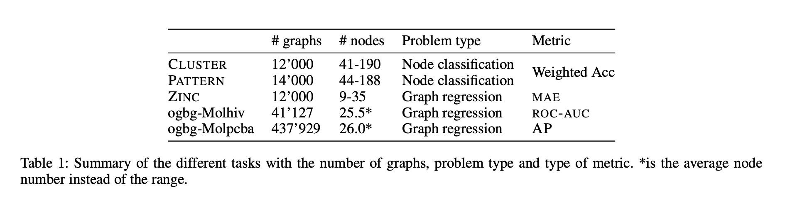
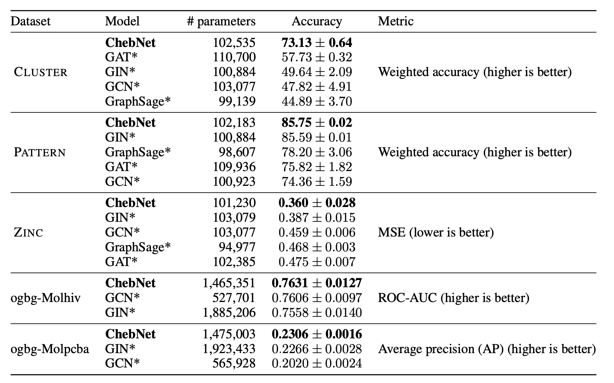

# An Experimental Study of the Transferability of Spectral Graph Networks

This repository holds the corresponding code to the paper ´An Experimental Study of the Transferability of Spectral Graph Networks´ by Axel Nilsson and Xavier Bresson. 

The focus of the work is to study the performance of the ChebNet, a spectral graph neural network, with regards to other spacial methods on datasets made out of sets of graphs.
The datasets are all from the open benchmarks OGB and benchmarking-gnns. The figure below shows the summary of the chosen tasks.

### Benchmarking gnns
Most of the structure of the code are simplifications made on the [benchmarking-gnns](https://github.com/graphdeeplearning/benchmarking-gnns) code base 

### Open Graph Benchmark (OGB)
The code used for [OGB](https://github.com/snap-stanford/ogb) is straightforward with small changes to the original [example notebooks](https://github.com/snap-stanford/ogb/tree/master/examples/graphproppred/code). We use the DGL framework to make sure to use the same model as for the benchmarking gnns experiments.

## To reproduce the results:

Setup your environment:

    conda env create -f environment_gpu.yml

#### OGB:
- In order to run a model on a given dataset `$DATASET` with an output file `$FILENAME` run the following command:

        python main_dgl.py --dataset $DATASET --gnn Cheb_net --filename $FILENAME

- Otherwise make sure to make a script that matches your config by tweaking on the script `script_ogb.sh`.
    
#### Benchmarking_gnns:
- In order to make run the benchmarking gnn datasets you should first download them by using the following commands:

        cd Benchmark-gnn/data/
        bash script_download_all_datasets.sh
    
- Then you can run the experiments by using the command:

        bash benchmark_gnn_script.sh
    
## Repository structure
    .
    ├── Benchmark-gnn/
        ├── configs/             # Files containing the configuration for the models for each task
        ├── data/ 
            ├──  Molecules
            └──  SBMS
        ├── layers/              # Definition of the ChebNet layer
        ├── nets/                # Definition of the structure of the NNs for each model
        ├── train/               # Trainig script for each task
        └── scripts              # Sets of scripts to run individually each task
    ├── OGB/
        ├── Dataset/
        ├── gnn_dgl.py           # Model definiton
        └── main_dgl.py          # Model training anf testing script
    ├── environment files        # Yml files used to set up the environment
    ├── LICENSE
    └── README.md
    
  ## Results
  The results as can be found in the paper:
  

  ## Reference
  
    @misc{nilsson2020experimental,
          title={An Experimental Study of the Transferability of Spectral Graph Networks}, 
          author={Axel Nilsson and Xavier Bresson},
          year={2020},
          eprint={2012.10258},
          archivePrefix={arXiv},
          primaryClass={cs.LG}
    }
